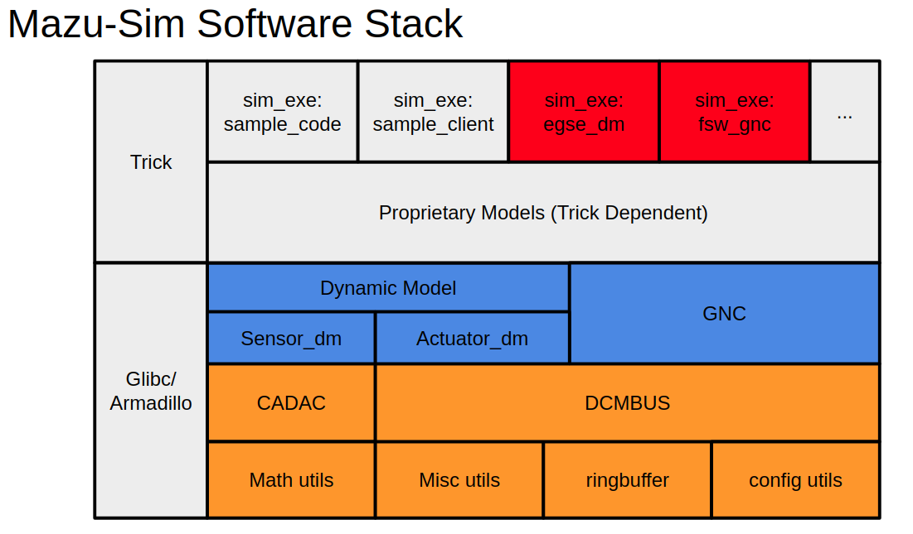

<p align=center>

</p>

# mazu-sim

Mazu simulation(mazu-sim) is 6DoF Rocket Simulation Platform.

It base on [Modeling INS/GPS/Star-Tracker in 6 DoF: Simulating NGC of a Three-Stage Rocket Booster in CADAC++](https://www.amazon.com/Modeling-INS-GPS-Star-Tracker-DoF/dp/1518899315)

The aim is to provide to verify flight software, and delivery accuracy hardware-in-the-loop and flight testing.

## Getting Started
### 0. Clone the Repo
```
$ git clone --recursive https://github.com/octoberskyTW/mazu-sim
```
### 1. Dependencies
 - GCC 5.4 up
 - Python 2.7
 - cpplint
```
$ sudo apt-get install htop cmake vim tree git-core libopenblas-dev libboost-dev libboost-all-dev bison curl flex python-pip clang-format cppcheck
$ pip install cpplint
```

### 2. Third-Party Installation
 - Armadillo Matrix Library-9.700.2
   - [Official Armadillo](http://arma.sourceforge.net/)
   ```
   third-party/armadillo $ tar xvf armadillo-9.700.2.tar.xz
   third-party/armadillo $ cd armadillo-9.700.2
   third-party/armadillo/armadillo-9.700.2 $ ./configure
   third-party/armadillo/armadillo-9.700.2 $ make
   third-party/armadillo/armadillo-9.700.2 $ sudo make install
   ``` 
- Google Test
  - Official Github [google test](https://github.com/google/googletest)
  ```bash
  $ sudo apt-get install libgtest-dev
  $ sudo apt-get install cmake # install cmake
  $ cd /usr/src/gtest
  $ sudo mkdir build && cd build
  $ sudo cmake .. && sudo make
  # copy or symlink libgtest.a and libgtest_main.a to your /usr/local/lib folder
  $ sudo cp *.a /usr/local/lib
  ```
 - NASA Trick 17.5 dev
   - Official Github [NASA/trick](https://github.com/nasa/trick)
   ```
   $ sudo apt-get install bison curl flex g++ libx11-dev libxml2-dev libxt-dev \
            libmotif-common libmotif-dev make openjdk-8-jdk python2.7-dev swig \
            zlib1g-dev llvm llvm-dev clang libclang-dev libudunits2-dev
   third-party/trick $ ./configure
   third-party/trick $ make
   third-party/trick $ sudo make install
   ```
- Redis-Server
  - Download Source: https://redis.io/download
  ```bash
    third-party/redis $ tar xzf redis-5.0.5.tar.gz
    third-party/redis $ cd redis-5.0.5
    third-party/redis/redis-5.0.5 $ make
    third-party/redis/redis-5.0.5 $ sudo make install
  ```
### 3. Build and Run a sample code
```
$ make
$ make run-sample
```

## Build and run the specific project
- Tutorial project: sample
  ```
  $ make project=sample
  $ make run-sample
  ```
- Rocket project: skyline
  ```
  $ make project=skyline
  $ make run-skyline
  ```
## Doxygen
```
$ sudo apt-get install graphviz doxygen
$ doxygen Doxyfile
```
open the docs/build/index.html in browser

<p align=center>

</p>

# Companies/Organization using mazu-sim
<p align=center>

</p>
- [Linux for Rocket Flight Control](https://elinux.org/images/1/1e/ELCE-2019-RT-Linux-for-Rocket-Flight-Control-Kang-Huang.pdf
